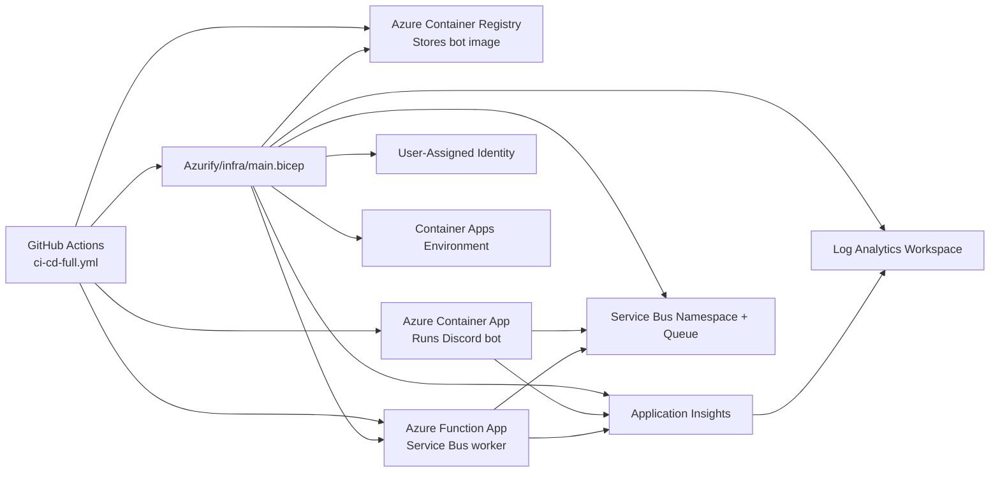

# Azurify Components Guide

This document explains the Azure-oriented pieces used in this repository, what each one is responsible for, and why it exists.

## Scope

The `Azurify/` folder provides infrastructure, setup scripts, and operational guidance.

The active CI/CD workflow for deployments lives at `.github/workflows/ci-cd-full.yml` in the repo root.

## Architecture Diagram

## Component Breakdown

| Component | File(s) | Used For | Why It Exists |
| --- | --- | --- | --- |
| Infrastructure as Code | `Azurify/infra/main.bicep`, `Azurify/infra/parameters.json`, `Azurify/infra/parameters.example.json` | Provisions ACR, Container Apps env, Service Bus queue, Log Analytics, App Insights, optional Function App + storage, managed identity, role assignments | Keeps cloud resources reproducible and versioned; avoids manual portal drift |
| Local deployment helper | `Azurify/deploy/azure-deploy.sh` | One-command local bootstrap/deploy using Azure CLI + Bicep | Fast manual setup for dev/test and troubleshooting outside CI |
| Container App template sample | `Azurify/containerapp/containerapp.job.yaml` | Reference YAML for Container Apps shape and scaling defaults | Handy template for direct YAML-based experiments or job-style extensions |
| OIDC and secret bootstrap scripts | `Azurify/scripts/setup_oidc.sh`, `Azurify/scripts/bootstrap_github_secrets.sh`, `Azurify/scripts/fix_role_assignment.sh` | Configure GitHub OIDC federation, seed GitHub secrets, fix IAM role assignment issues | Hardens auth (OIDC over long-lived creds) and reduces setup friction |
| Bicep validation script | `Azurify/scripts/validate_bicep_api_versions.sh` | Sanity-checks Bicep API versions | Prevents deployment failures caused by stale or unsupported API versions |
| Observability snippets | `Azurify/telemetry/app_insights_snippet.py`, `Azurify/telemetry/README.md` | App Insights instrumentation patterns for Python code | Gives a baseline telemetry implementation for traces and errors |
| Security guidance docs | `Azurify/SECRETS_SETUP.md`, `Azurify/WORKLOAD_IDENTITY_SETUP.md` | Secret management and GitHub-to-Azure OIDC setup docs | Documents secure runtime config and CI auth patterns |
| High-level architecture notes | `Azurify/ARCHITECTURE.md` | Tradeoffs and architecture decisions (Functions + Container Apps) | Captures rationale and alternatives for future maintainers |

## Runtime Responsibilities

| Runtime Piece | Responsibility | Why This Split |
| --- | --- | --- |
| Container App (`siphonbot-app`) | Main Discord bot process, slash-command handling, startup config checks | Long-running bot gateway is a good fit for containerized always-available process |
| Function App (`siphonbot-func`) | Async queue worker for Service Bus jobs (`process_media`) | Offloads heavier or delayed work from the interactive bot flow |
| Service Bus queue (`siphon-queue`) | Decouples command intake from background processing | Improves resilience and smooths spikes in workload |

## Deployment Flow

1. CI logs into Azure (OIDC preferred; service principal fallback).
2. Bicep ensures infra resources exist and outputs IDs/secrets needed for runtime.
3. Bot image is built and pushed to ACR.
4. Container App is updated to the new image and environment settings.
5. Function App package is deployed and triggers are synchronized.
6. Health checks verify the active Container App revision state.

## Why This Design Works Here

1. It separates interactive bot latency from background media processing.
2. It keeps infra declarative while still allowing script-based operational fixes.
3. It supports secure auth patterns (managed identity + OIDC).
4. It centralizes telemetry through App Insights + Log Analytics.

## Where To Start

1. Read `Azurify/infra/main.bicep` to understand resource topology.
2. Read `.github/workflows/ci-cd-full.yml` to understand deployment order and health checks.
3. Use `Azurify/WORKLOAD_IDENTITY_SETUP.md` to configure GitHub OIDC.
4. Use `Azurify/SECRETS_SETUP.md` to validate runtime secret paths.
